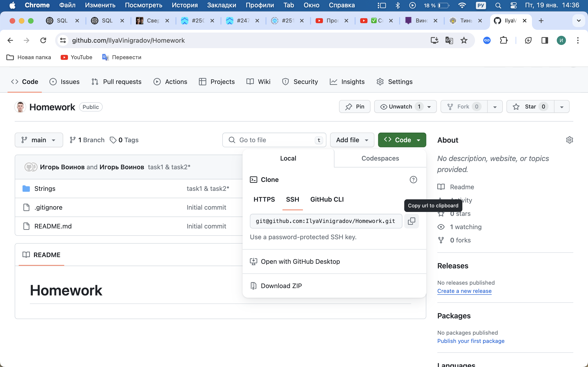

# Homework
## Как начать решать задачи?
1. Переходишь по ссылке
2. Делаешь клон задания  (кнопка Code -> SSH -> copy url to clipboard)
3. В терминале пишешь команду (но нужно предварительно выбрать, где хочешь чтобы распологалась папака с заданиями): git clone ссылка(ctrl + v)
4. Нажимаешь enter
5. Создаешь свою ветку для решений: git checkout -b название ветки
6. Решаешь

## Что делать когда решил?
1. git add .
2. git commit -m 'описываешь что получилось или что не получилось'
3. git push origin имя ветки на которой решал задачи